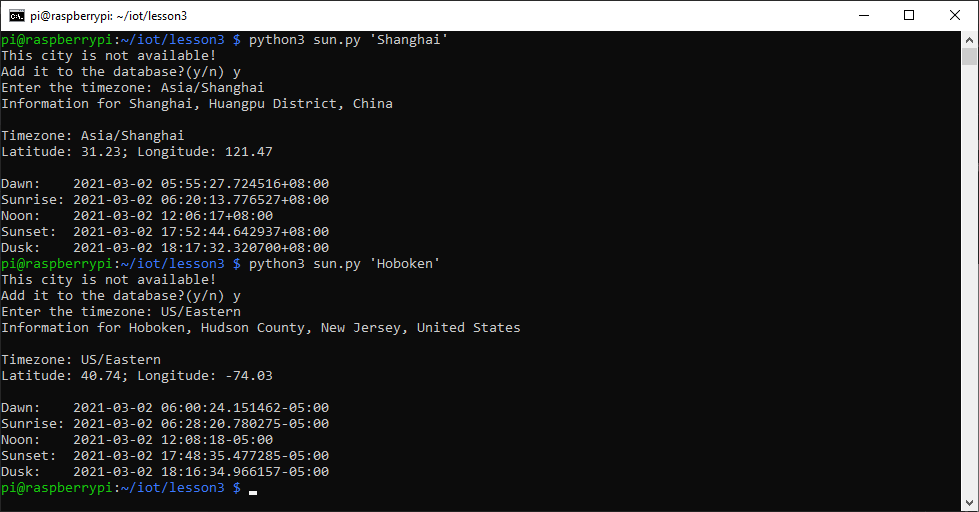

# Lesson 3
Modified sun.py. 
* It is able to display dawn, sunrise, noon, sunset, and dusk times of a city that is not in the astral.geocoder database.
* Users are able to manually add the city to the database by entering the timezone.
* It generates the geographic location of the city by using Nominatim from geopy.geocoders library. (example is given in coordinates.py)

